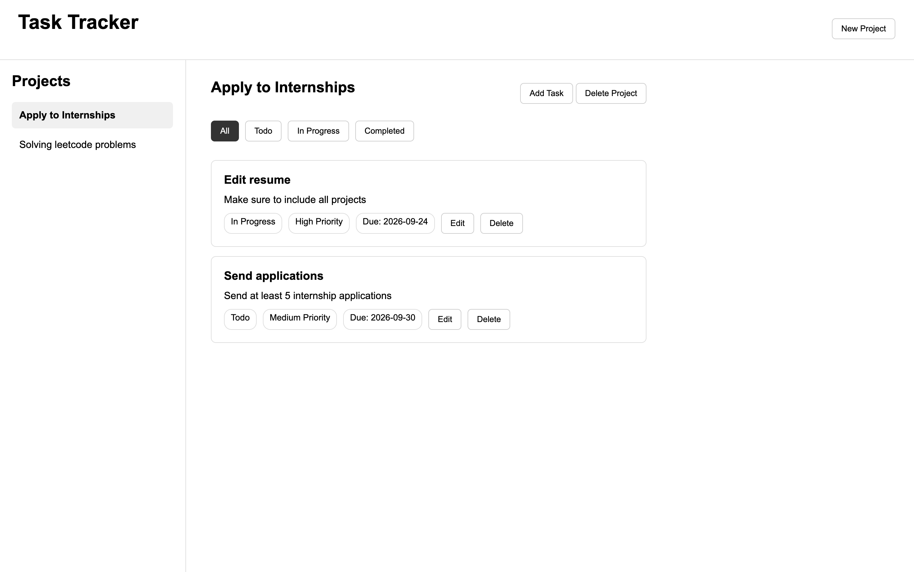

# Task & Project Tracker
A full-stack task and project management application built with Python, FastAPI, PostgreSQL, and vanilla JavaScript.

The application provides a REST API backed by a relational PostgreSQL database and a browser-based interface for managing projects and tasks.

## Live Demo
[View the live application](https://task-project-tracker-frontend.onrender.com)

> The application is hosted on Render's free tier, so the backend may take a short time to respond after a period of inactivity.



## Features
- Create, view, and delete projects
- Create, view, update, and delete tasks
- Switch between projects and view their tasks
- Filter tasks by status
- Track task priority, status, due dates, and descriptions
- Automatically delete associated tasks when a project is deleted
- View project task summaries through the API
- Automatically update task modification timestamps using a PostgreSQL trigger
- Reset and recreate the local development database using a shell script

## Tech Stack

### Backend
- Python
- FastAPI
- Pydantic
- psycopg2

### Database
- PostgreSQL
- SQL
- PL/pgSQL triggers

### Frontend
- HTML
- CSS
- JavaScript

### Tools
- Git
- Shell scripting
- Render

## Project Structure
```text
task-project-tracker/
├── app/
│   ├── __init__.py
│   ├── database.py
│   └── main.py
├── frontend/
│   ├── index.html
│   ├── script.js
│   └── style.css
├── scripts/
│   ├── reset_db.sh
│   └── run.sh
├── sql/
│   └── schema.sql
├── requirements.txt
└── README.md
```

## Database Design
The database contains two main tables:
- `projects` - stores project details
- `tasks` - stores tasks belonging to a project through `project_id`

Tasks include a title, description, status, priority, due date, and timestamps.

PostgreSQL constraints restrict task status and priority to valid values. A foreign key connects tasks to projects with `ON DELETE CASCADE`, so deleting a project also deletes its associated tasks.

A PostgreSQL trigger automatically updates the `updated_at` timestamp whenever a task is modified.

## Setup
Requires Python and PostgreSQL.

Clone the repository and set up the Python environment:

```bash
git clone https://github.com/DupthobJampa/task-project-tracker.git
cd task-project-tracker

python3 -m venv .venv
source .venv/bin/activate
pip install -r requirements.txt
```

Create or reset the local PostgreSQL database:
```bash
./scripts/reset_db.sh
```

Start the FastAPI backend:
```bash
./scripts/run.sh
```

The API runs at `http://127.0.0.1:8000`.

Interactive API documentation is available at `http://127.0.0.1:8000/docs`.

To use the frontend, open the `frontend` directory with a local development server such as VS Code Live Preview. The frontend communicates with the FastAPI backend running on port `8000`.

## API Endpoints
| Method | Endpoint | Description |
|--------|----------|-------------|
| GET | `/projects` | List all projects |
| POST | `/projects` | Create a project |
| DELETE | `/projects/{project_id}` | Delete a project and its tasks |
| GET | `/tasks` | List and filter tasks |
| GET | `/tasks/{task_id}` | Get a specific task |
| POST | `/projects/{project_id}/tasks` | Create a task for a project |
| PUT | `/tasks/{task_id}` | Update a task |
| DELETE | `/tasks/{task_id}` | Delete a task |
| GET | `/projects/{project_id}/summary` | View a project's task summary |

Tasks can be filtered using query parameters:
```text
/tasks?status=todo
/tasks?project_id=1
/tasks?status=todo&project_id=1
```
